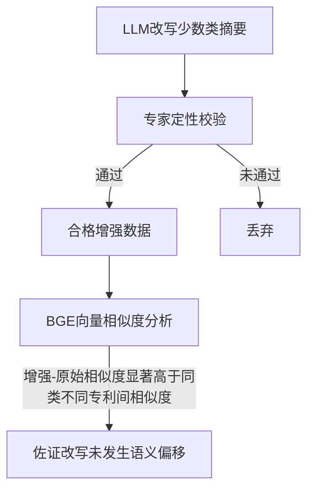

---
总进度:已完成
版本:v2
---

# LLM增强摘要质量评估方案

> **v1 → v2 变更说明**
>
> v1采用"闭环改写 + BGE阈值筛选 + 专家校验"方案，BGE相似度作为硬性阈值筛选进入专家校验的样本。该方案存在以下问题：
> 1. 阈值设定缺乏理论依据，审稿人可质疑阈值选取的合理性；
> 2. 向量相似度衡量的是语义方向，而非技术内容忠实性，用语义指标做硬性阈值筛选技术内容，逻辑链不严密；
> 3. 若阈值形同虚设（所有样本均通过），则闭环机制无意义；若拦截了样本，又要解释拦截标准。
>
> v2将BGE相似度从"决策关卡"降为"定量佐证"，由专家校验承担方法论责任，BGE提供语义层面的描述性证据，避免阈值自证陷阱。

## 数据位置
- 增强数据集:D:\WorkSpace\JupyterWorkSpace\pq\app\openSpec\docs\idea\problem6\input\增强数据集_输血透析体外循环.parquet
- 原始数据集:D:\WorkSpace\JupyterWorkSpace\pq\app\openSpec\docs\idea\start\output\数据集_D2_D3高置信.parquet
两者通过申请号进行数据关联，标签列为last_label，摘要的嵌入列为bge且为保证灵活性未进行归一化

## 评估框架

## 第一阶段：专家定性校验

**定位：质量把关的决策关卡**

专家从以下三个维度逐一校验生成文本是否在技术内容上忠实于原文：

| 维度 | 关注内容 | 典型问题示例 |
|------|----------|-------------|
| 实体一致性 | 关键术语、器械名称、IPC分类号等核心实体是否保留 | 原文"超滤膜片"被替换为"过滤膜片" |
| 技术逻辑自洽性 | 实体之间的技术关系是否合理，是否存在术语正确但组合错误的情况 | "超滤膜片"+"扩散清除"——术语都对，但在透析中超滤对应的是跨膜压差驱动，而非扩散 |
| 技术边界忠实性 | 生成文本是否超出原文披露范围，编造了原文不存在的技术特征 | 原文未提及温度参数，LLM自行补充"37°C恒温控制" |

**不可替代性：** 上述三个维度均需要领域知识判断，自动化手段无法完全替代。专家校验作为唯一决策关卡，直接决定增强数据的去留。

## 第二阶段：BGE向量相似度分析

**定位：语义保真性的定量佐证**

对通过专家校验的增强数据，计算BGE嵌入向量余弦相似度，从语义层面描述增强数据与原始数据的关系。

### 分析方法

**数据定义：**

- **增强数据**：62条，全部为LLM改写后的专利摘要，来源为 `problem6/input/增强数据集_输血透析体外循环.parquet`
- **原始数据**：31条，从 `数据集_D2_D3高置信.parquet` 中筛选 `last_label == "输血、透析和体外循环器械"` 的真实专利摘要

**三个相似度指标的定义：**

| 指标 | 定义 | 计算方式 | 对数 | 回答什么问题 |
|------|------|---------|------|-------------|
| **增强-原始（同申请号）** | 每条增强摘要与其对应的原始摘要之间的余弦相似度 | 通过申请号关联，同一申请号的增强摘要与原始摘要计算余弦相似度 | 62对 | LLM改写后与原文的语义一致性如何？ |
| **原始类内（同类不同专利）** | 同类别中不同专利摘要两两之间的余弦相似度 | 31条原始专利摘要之间两两组合，计算余弦相似度 | C(31,2)=465对 | 同类别不同专利之间的自然语义差异有多大？作为增强-原始相似度的参照基准 |
| **增强类内** | 增强摘要两两之间的余弦相似度 | 62条增强摘要之间两两组合，计算余弦相似度 | C(62,2)=1891对 | 改写后的数据之间的语义聚集程度如何？ |

**计算流程：**

1. 从parquet文件中读取bge列（未归一化的嵌入向量）
2. 在内存中对bge向量进行L2归一化（不写回原文件，归一化不可逆）
3. 对归一化后的向量计算余弦相似度（即点积）
4. 按上述三种方式分组统计

**分析逻辑：**

1. 对增强数据与对应原始数据（同申请号）计算余弦相似度，得到**增强-原始相似度**
2. 对原始数据类内两两计算余弦相似度，得到**原始类内相似度**（同类不同专利间的自然语义差异，作为参照基准）
3. 比较两者分布：若增强-原始相似度显著高于原始类内相似度，则说明增强文本与原文的语义关系比同类不同专利间更紧密，改写未发生语义偏移

**分析代码：** `problem6/output/task6_similarity_analysis.py`

### 分析结论

> 增强文本与原始文本的余弦相似度均值为0.83，显著高于同类不同专利间的相似度水平（均值0.56），表明LLM改写未导致语义偏移。

**详细数据：**

| 指标 | 增强-原始（同申请号） | 原始类内（同类不同专利） | 增强类内 |
|------|----------------------|------------------------|---------|
| 样本数 | 62 | 465 | 1891 |
| 均值 | 0.8310 | 0.5637 | 0.6397 |
| 标准差 | 0.0722 | 0.0983 | 0.0867 |
| 最小值 | 0.6360 | 0.3586 | 0.3760 |
| 最大值 | 0.9607 | 0.8402 | 0.9873 |
| P5 | 0.7223 | 0.4167 | 0.5020 |
| P25 | 0.7814 | 0.4893 | 0.5870 |
| P50 | 0.8375 | 0.5550 | 0.6381 |
| P75 | 0.8804 | 0.6289 | 0.6876 |
| P95 | 0.9502 | 0.7446 | 0.7737 |

**关键对比：**

- 增强-原始均值（0.83）是原始类内均值（0.56）的1.47倍
- 增强-原始P5（0.72）接近原始类内P95（0.74），即95%的增强样本与原文的语义一致性达到或超过同类不同专利间的上界水平
- 增强-原始最小值（0.64）仍高于原始类内均值（0.56），即使最不理想的改写样本，其与原文的语义关系仍优于同类不同专利间的平均水平

**局限性说明：** 原始类内相似度是同类不同专利之间的语义差异（不同发明之间的自然差异），而非同一专利不同表述之间的差异。后者是更理想的基准，但获取成本高。当前基准是保守估计——同类不同专利描述的是不同技术方案，语义差异天然较大，以此为基准对增强质量的要求实际更宽松。

### 为什么不设阈值

- 向量相似度衡量语义方向，不等于技术内容忠实性，不宜作为硬性筛选标准
- 阈值选取缺乏理论推导，容易成为审稿攻击点
- 将相似度作为描述性证据报告，比作为决策依据更诚实、更站得住脚

## 两阶段关系

| 阶段 | 回答的问题 | 性质 |
|------|-----------|------|
| 专家校验 | 改写是否**可靠**（技术内容层面） | 决策关卡，决定数据去留 |
| BGE相似度 | 改写是否**偏离**（语义方向层面） | 定量佐证，描述性证据 |

专家校验从技术内容层面保障增强数据的可靠性，BGE相似度从语义层面佐证改写未发生偏移。两者互补：专家校验承担方法论责任，BGE提供定量支撑，使结论更具说服力。

## 实现步骤

- [x] 专家校验：校验实体一致性、技术逻辑自洽性、技术边界忠实性
- [x] 定量分析：基于BGE向量相似度，分析增强数据与原始数据的语义关系，佐证改写未发生偏移
