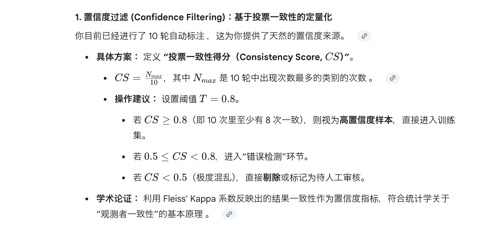
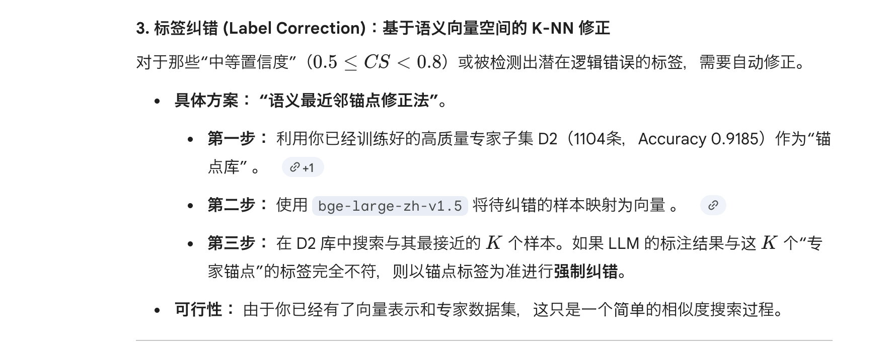

## 进度

- [ ] 问题4
- [ ] 问题5
- [ ] 问题6
- [ ] 问题7
- [ ] 问题8
- [ ] 问题9
- [x] 问题10
- [ ] 问题11

## 问题4
> 第三章，数据筛选规则不够严谨，缺少去重机制与数据统计分析，数据代表性与纯净度论证不足。
- 去重机制：专利不存在重复（可能以为同一个专利存在多条记录）
- 纯净度：需论证检索式，A61B是否真的都与医疗器械相关？
---
> 数据集的自动标注主要依赖LLM，但未做“领域适配”，没有在垂 直领域上微调，虽有RAG知识库支持标注，但知识单薄(只有《分类目录》，缺少法规、指导原则、审查指南等)。
- 微调：无
- 知识单薄：补充知识库，已确定补充的内容包括，[医疗器械分类规则](https://www.samr.gov.cn/zw/zfxxgk/fdzdgknr/bgt/art/2023/art_24dbff6e15494c9cb112ea15ed158001.html)
---
> 另外，标签纠错、错误检测、置信度过滤等处理也没有考虑。
- 置信度过滤：
- 标签纠错：
---

## 问题5
> 实验部分本文标注方法只和“原始标签”比，不和 “其他标注方法“比较，无法证明论文方法优势。
- 其他标注方法：llm、关键词匹配（bm25 | llm从《医疗器械分类目录》提取关键词，然后匹配）
---
> 缺少”案例分析“。
- 案例分析：挑几条数据，分析一下原始标签、llm标注、关键词匹配标注、本文方法标注的结果，分析一下为什么会有差异，本文方法是如何纠正错误的。
---

## 问题6
> 用LLM改写少数类文本，扩充数据。专利文本的严谨性是否能随便生成？是否会改变技术内容，本部分没有经过专家校验。
- 专家校验：生成的数量较少，可以专家校验生成文本的严谨性
- 定量评估：基于向量检索，评估生成文本与原文本的相似度，确保生成文本与原文本在技术内容上保持一致。
---

## 问题7
> 第四章提出的BERT-TextCNN 是2018-2020年的经典组合结构，不是新模型。因此本方法仅属于简单组合，无原创性结构创新与机制创新，理论深度与学术贡献不足
- 无法修改，但需要给出合理解释
---

## 问题8
> 医疗器械分类目录具有明确层级结构(1，2，3级)，本文方法未采用层次分类， 违背目录结构，问题定义上实用性较弱。
- 无法修改，但需要给出合理解释
- 层级结构：本身数据标签就缺失，进行到2级，某些类别数量可能就为0了
- 实用性：本文是该方向的前期研究，所以从1级开始
---

## 问题9
> 对比实验中，对比基线严重陈旧LR、KNN、RF、XGBoost，单独 BERT、单独 Text CNN，没有对比近年专利分类/文本分类优秀方法。无法证明方法的优秀性。
- 增加对比模型：选择较新的2个模型进行对比
---
> 消融实验做了数据增强消和模型模块消融，缺少最关键的“层次信息”，“领域知识”等消融。
- 层次信息：文本不涉及层次信息。
- 领域知识：去掉微调bert可视为去掉领域知识
---
> 外部验证集数据量不大且来源单一（同源），无法证明泛化能力和工业可用性。
- 同源：训练集截止到23年底，外部验证是2025年最新数据。本质上所有专利都同源
- 与医知桥对比：医知桥是市面上唯一一家提供22类医疗器械分类的平台，因此仅能与其进行对比，无法与其他平台进行对比。
---

## 问题10
> 第五章，需求系统功能完整性不足，仅实现单条专利文本分类，未支持批量上传 、批量分类、结果导出等实际业务高频，工程性较弱。
- 功能需求：按照意见实现批量上传、批量分类、结果导出等功能
---
> 未表述系统的非功能需求。整体流程缺少”系统测试与验证“，开发流程不完整。
- 非功能需求、系统测试与验证：在论文中补充非功能需求，并在系统开发完成后进行系统测试与验证，确保系统的稳定性和可靠性。
---

## 问题11
> 本文口语化、冗余表述较多；图表不太规范。部分图片里文字较小，表格尽量不分页（或用续表拆分），建议全文格式再修改。
- 措施：完成问题1-10后，进行全文的格式修改，确保语言表达规范、图表清晰、表格分页合理。
---
