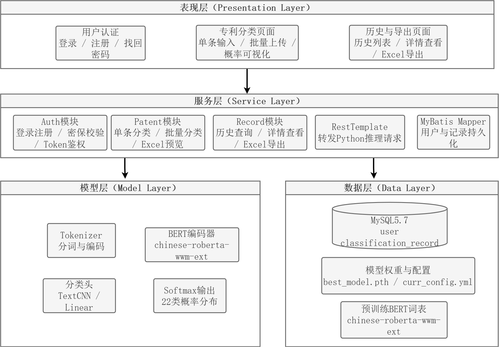

# 系统设计与实现

前述章节完成了医疗器械发明专利分类数据集构建、分类模型训练与实验评估。为了检验分类模型在实际应用场景中的可用性，本文在模型研究基础上设计并实现了一套基于 B/S 架构的医疗器械专利自动分类系统。系统不仅提供单条专利摘要在线分类功能，还支持批量文件上传、批量分类、分类历史查询、条件筛选和结果导出等功能，以满足专利文本分类任务中批量处理和结果留存的需要。

本章主要介绍系统需求分析、系统架构设计、数据库设计、核心功能实现和系统测试验证。章节内容围绕两项任务展开：一是说明第四章训练得到的分类模型如何接入实际软件系统；二是针对盲审意见中提出的系统功能完整性不足、非功能需求缺失和系统测试不充分等问题进行补充说明。

## 5.1 需求分析

医疗器械专利分类系统的应用目标，是将非结构化专利摘要文本映射到《医疗器械分类目录》的一级产品类别，并对分类结果进行保存、查询和导出。与单次模型预测不同，实际使用过程通常包含批量导入、结果复核、历史追踪和离线归档等环节。因此，系统需求既包括模型推理功能，也包括围绕分类结果展开的数据管理功能。

### 5.1.1 功能需求分析

根据系统业务流程，本文将系统功能划分为用户模块、单条分类模块、批量分类模块、分类历史记录模块、结果导出模块和分类结果可视化模块。各模块共同构成从用户登录、文本提交、模型推理到结果管理的完整流程。

（1）用户模块

用户模块用于完成系统访问控制和用户身份识别，主要包括用户注册、登录认证、密保问题查询、密保答案校验和密码重置等功能。用户登录成功后，后端生成包含用户标识和时间戳的 Token，前端将其保存到本地，并在后续请求中通过请求头携带。后端根据 Token 解析用户身份，并将分类记录与用户账号关联，从而支持历史记录的用户级隔离。

（2）单条分类模块

单条分类模块用于处理单篇专利摘要的即时分类需求。用户在前端页面输入专利摘要后，系统调用 Java 后端分类接口；Java 后端完成摘要内容校验后，将文本转发至 Python 推理服务。Python 服务加载已训练完成的 BERT-TextCNN 模型，返回预测类别、类别索引、置信度以及 22 个类别的概率分布。Java 后端接收预测结果后，将其返回给前端展示，同时写入数据库。

（3）批量分类模块

实际专利分类工作中，用户往往需要一次处理多条专利摘要。为减少重复输入操作，系统增加批量分类功能，支持用户上传 Excel 文件。文件上传后，系统先解析列名和前若干行数据，供用户确认摘要所在列；用户确认后，后端为本次批量任务生成唯一批次 ID，并逐条调用 Python 推理服务完成分类。当前系统将单次批量分类上限设置为 50 条，以控制请求耗时和模型推理资源占用。若单条记录处理失败，系统将失败原因记录到失败列表中，不影响同批次其他记录继续执行。

（4）分类历史记录模块

分类历史记录模块用于保存和查询用户历次分类结果。记录内容包括专利摘要、预测类别、类别索引、预测置信度、全部类别概率分布、来源类型、批次 ID 和分类时间。用户可按照预测类别、时间范围、来源类型、摘要关键字和批次 ID 进行筛选，并可查看单条分类记录详情。其中，批次 ID 用于关联同一次批量分类任务中的多条记录，便于后续集中复核。

（5）结果导出模块

系统提供 Excel 导出功能，用于支持分类结果的离线复核和归档。用户在历史记录页面设置筛选条件后，可导出符合条件的分类记录。导出字段包括序号、专利摘要、预测类别、置信度、来源类型、批次 ID 和分类时间。为避免空数据导出和大批量导出造成服务压力，后端在导出前检查记录数量；当记录为空或超过 200 条时，系统返回相应提示。

（6）分类结果可视化模块

系统除输出最终预测类别外，还展示模型对 22 个类别的概率判断。前端使用 ECharts 绘制概率分布图，以直观方式呈现不同类别的置信度差异。对于相近类别或交叉技术领域的专利摘要，概率分布能够为人工复核提供辅助依据。

### 5.1.2 非功能性需求分析

非功能性需求用于约束系统运行质量。结合本系统的使用场景，本文选取直接影响用户体验和结果可用性的核心指标进行说明，包括在线分类响应、批量处理、历史查询、结果导出、权限隔离和异常处理等内容，如表 5-1 所示。上述指标面向本课题原型系统和小规模业务验证场景，不作为高并发 Web 平台的吞吐能力要求。

表 5-1 系统非功能性需求

| 指标项 | 具体要求 |
| --- | --- |
| 单条分类响应 | 模型预加载后，单条分类接口 t95 响应时间不超过 3 s |
| 批量分类能力 | 单次批量分类不超过 50 条，任务应在 5 min 内完成 |
| 历史查询与导出 | 常规筛选查询 t95 响应时间不超过 2 s；单次导出不超过 200 条 |
| 用户数据隔离 | 历史记录、详情和导出接口均需校验 Token，用户只能访问本人记录 |
| 异常处理 | Python 服务异常或批量任务单条失败时，系统应返回错误提示，批量任务不中断 |

从表 5-1 可以看出，本文未单独设置高并发吞吐指标，而是围绕用户完成分类任务时最直接感知到的环节进行约束。其中，t95 表示 95% 请求的响应时间不超过给定阈值。上述需求也为后续系统测试提供了可检查的依据。

## 5.2 系统设计

### 5.2.1 系统架构设计

本系统采用前后端分离的B/S架构，并将业务服务、模型推理和数据资源分开组织。分类模型的运行环境与常规Web业务不同，若直接嵌入Java后端，会增加依赖管理和部署维护的复杂度。本文据此将系统划分为表现层、服务层、模型层和数据层四个部分，其中模型层与数据层位于后端支撑侧，共同服务于上层业务流程。系统整体结构如图5-1所示。

图5-1 系统架构图（可编辑源文件：`../figures/ch5-system-architecture.drawio`）

表现层面向用户操作，主要包括用户认证、专利分类、历史与导出三个页面入口。用户认证页面完成登录、注册和找回密码；专利分类页面承担单条文本输入、批量上传和分类概率可视化；历史与导出页面用于查看分类历史、打开记录详情和导出Excel结果。该层通过前端页面收集操作请求，再交由服务层处理。

服务层承担系统业务控制，包含Auth模块、Patent模块、Record模块、RestTemplate调用组件和MyBatis Mapper组件。Auth模块处理登录注册、密保校验和Token鉴权；Patent模块处理单条分类、批量分类和Excel预览；Record模块处理历史查询、详情查看和Excel导出。需要执行模型预测时，Patent模块通过RestTemplate把请求转发至Python推理服务；涉及用户与分类记录保存、查询或导出时，服务层经MyBatis Mapper访问数据库。这样处理后，前端不直接接触模型服务和数据库。

模型层负责专利摘要文本的类别预测。推理流程从Tokenizer分词与编码开始，随后输入BERT编码器获得文本语义表示，再经过TextCNN或Linear分类头计算分类结果，Softmax在输出端给出22类医疗器械专利类别的概率分布。该层只处理模型推理相关任务，不承担用户认证、历史查询等业务逻辑，因此模型代码与业务代码之间的边界较为清楚。

数据层保存系统运行所需的业务数据和模型资源。MySQL5.7数据库中主要包含`user`表和`classification_record`表，分别对应用户信息和分类记录；模型权重与配置文件包括`best_model.pth`和`curr_config.yml`；预训练BERT词表采用`chinese-roberta-wwm-ext`相关资源。MyBatis Mapper面向MySQL执行持久化操作，模型层则读取权重、配置和词表文件完成推理初始化。一次分类请求的处理路径较短：用户在表现层提交文本或文件，服务层完成鉴权和业务校验，模型层返回类别概率，服务层保存结果并将结果返回前端展示。

### 5.2.2 数据库设计

系统数据库用于保存用户认证信息和分类记录信息，主要包含 `user` 用户表和 `classification_record` 分类记录表。一个用户可以对应多条分类记录，两张表之间通过用户 ID 建立关联。数据库 ER 图如图 5-2 所示。

图 5-2 数据库 ER 图（可编辑源文件：`../figures/ch5-er-diagram.drawio`）

`user` 表用于保存用户账号、密码、密保问题和密保答案等信息，其字段设计如表 5-2 所示。

表 5-2 用户信息表

| 字段名称 | 数据类型 | 约束条件 | 字段说明 |
| --- | --- | --- | --- |
| id | INT | Primary Key, Auto Increment | 用户唯一标识 |
| username | VARCHAR(50) | Unique, Not Null | 登录用户名 |
| password | VARCHAR(100) | Not Null | 用户密码 |
| question | VARCHAR(200) | Not Null | 密码找回安全问题 |
| answer | VARCHAR(200) | Not Null | 密码找回安全答案 |

`classification_record` 表用于保存分类输出结果，其字段设计如表 5-3 所示。该表通过 `source` 字段区分单条分类和批量分类，通过 `batch_id` 字段标识同一次批量任务，从而支持按来源和按批次查询。

表 5-3 分类记录表

| 字段名称 | 数据类型 | 约束条件 | 字段说明 |
| --- | --- | --- | --- |
| id | BIGINT | Primary Key, Auto Increment | 记录唯一标识 |
| user_id | INT | Index, Not Null | 用户 ID，0 表示匿名用户 |
| summary | TEXT | Not Null | 输入的专利摘要文本 |
| pred_label | VARCHAR(100) | Not Null | 模型预测类别名称 |
| pred_index | INT | Not Null | 预测类别索引 |
| pred_probability | DOUBLE | Not Null | 预测置信度 |
| top_categories | JSON | Nullable | 22 类概率分布 |
| source | VARCHAR(20) | Not Null | 来源类型，single 或 batch |
| batch_id | VARCHAR(50) | Index, Nullable | 批量分类批次 ID |
| create_time | DATETIME | Index, Not Null | 分类时间 |

### 5.2.3 核心业务流程设计

系统核心业务流程包括单条分类流程和批量分类流程。单条分类流程中，用户提交摘要后，Java 后端校验文本内容并调用 Python 推理服务，获得预测结果后写入数据库并返回前端展示。

批量分类流程包括文件预览、摘要列选择、批量推理和结果存储。用户先上传文件并预览列名，再选择摘要列提交批量任务；Java 后端解析指定列内容，生成批次 ID，逐条调用 Python 推理服务；分类成功的记录写入数据库，失败记录随响应返回前端。该流程通过批次 ID 和失败列表机制，提高了批量分类结果的可追溯性和任务执行的容错性。

## 5.3 系统实现

### 5.3.1 开发环境及工具

系统实现涉及前端、Java 后端、Python 推理服务和数据库等多个运行环境。本文采用的主要开发工具和技术栈如表 5-4 所示。

表 5-4 开发环境及工具配置

| 类别 | 名称/版本 | 说明 |
| --- | --- | --- |
| 操作系统 | Windows 11 x64 | 基础运行平台 |
| 前端运行环境 | Node.js | 前端依赖管理与开发服务 |
| 前端技术栈 | Vue.js 2.x、Element UI、ECharts、Axios | 页面交互、组件展示、图表绘制和接口请求 |
| Java 后端 | JDK 1.8、Spring Boot 2.6.13、MyBatis | 业务逻辑、接口服务和数据库访问 |
| Python 后端 | Python、Flask、PyTorch | 模型推理服务 |
| 数据库 | MySQL 5.7 | 用户信息与分类记录持久化 |
| 文件处理 | EasyExcel | Excel 文件解析和导出 |

### 5.3.2 用户模块实现

用户模块基于 Spring Boot 实现。用户注册时，后端先检查用户名是否已经存在；若不存在，则将用户信息写入 `user` 表。用户登录时，后端根据用户名和密码查询用户记录，验证通过后生成 Token 并返回给前端。前端将 Token 保存到本地，并在后续请求中放入 `Authorization` 请求头。

密码找回功能采用密保问题方式实现。用户根据用户名获取密保问题，提交答案后由后端进行校验；校验通过后，用户可重置密码。该模块为分类记录的用户级管理提供了基础。

> 图 5-3 用户模块功能界面（后续补充系统截图）

### 5.3.3 单条分类模块实现

单条分类模块通过 `/api/patent/classify` 接口实现。前端提交摘要后，Java 后端先判断摘要是否为空，再从 Token 中解析用户 ID，并将摘要封装为 JSON 请求发送至 Python 推理服务的 `/predict` 接口。

Python 推理服务接收到文本后，使用 BERT 分词器进行编码，得到模型所需的 `input_ids` 和 `attention_mask`。随后，服务端将张量输入 BERT-TextCNN 模型，得到 22 维 logits，并通过 Softmax 转换为概率分布。概率最高的类别作为预测类别返回。Java 后端收到结果后，将摘要、预测类别、类别索引、置信度、全部类别概率分布和来源类型写入 `classification_record` 表；单条分类记录的 `source` 字段取值为 `single`。

前端接收结果后展示预测类别、置信度和概率分布图，使用户既能获得最终分类标签，也能查看模型对其他类别的概率判断。

> 图 5-4 单条分类功能界面（后续补充系统截图）

### 5.3.4 批量分类模块实现

批量分类模块由 `/api/patent/upload-preview` 和 `/api/patent/batch-classify` 两个接口配合完成。其中，前者负责文件预览，后者负责执行批量分类。

用户上传 Excel 文件后，前端将文件发送至 `/api/patent/upload-preview`。后端检查文件是否为空，并判断文件格式是否符合批量导入要求。校验通过后，系统使用 EasyExcel 解析表头和数据行，返回列名列表、总行数以及前 5 行预览数据。用户据此选择摘要所在列。

用户确认摘要列后，前端将文件和列名提交至 `/api/patent/batch-classify`。后端重新解析文件，检查摘要列是否存在，同时判断记录数是否超过 50 条。通过校验后，系统生成 UUID 作为本次任务的 `batch_id`，再逐条读取摘要并调用 Python 推理服务。逐条调用策略能够降低模型服务瞬时压力，并便于记录单条失败原因。

分类成功的记录被封装为 `ClassificationRecord` 对象，其中 `source` 设置为 `batch`，`batch_id` 设置为本次任务 ID。批量任务结束后，系统将成功记录写入数据库，并向前端返回批次 ID、总数、成功数、失败数、成功结果列表和失败列表。用户后续可在历史页面通过批次 ID 查询本次任务的全部结果。

> 图 5-5 批量分类功能界面（后续补充系统截图）

### 5.3.5 分类历史与导出模块实现

分类历史模块通过 `/api/record/list` 和 `/api/record/{id}` 接口实现。列表接口支持预测类别、开始时间、结束时间、来源类型、摘要关键字和批次 ID 等筛选条件。后端解析 Token 得到用户 ID，并将其作为隐式查询条件，保证用户只能查询本人分类记录。

详情接口返回单条记录的完整摘要和全部类别概率分布。前端在详情弹窗中复用概率图组件，使在线分类结果和历史记录详情保持一致的展示方式。

导出模块通过 `/api/record/export` 接口实现。用户设置筛选条件后点击导出，后端先统计符合条件的记录数量。数量为 0 时，系统返回“暂无数据”；超过 200 条时，提示用户缩小筛选范围；数量符合要求时，系统查询记录并使用 EasyExcel 生成 Excel 文件，以响应流形式返回前端。导出内容可用于离线复核和阶段性结果归档。

> 图 5-6 分类历史与结果导出功能界面（后续补充系统截图）

## 5.4 系统测试与验证

系统开发完成后，需要通过测试验证其功能完整性和运行稳定性。本文从功能测试和非功能测试两个角度进行验证，测试范围覆盖用户认证、单条分类、批量分类、历史记录、筛选查询和结果导出等主要流程。

### 5.4.1 功能测试

功能测试用例如表 5-5 所示。为避免测试表过长，本文选取能够覆盖主要业务闭环的核心用例进行列示，包括用户认证、单条分类、批量分类、历史查询、详情查看和结果导出等功能。测试结果显示，系统能够覆盖单条分类、批量处理和结果管理等核心需求。

表 5-5 系统功能测试用例

| 用例编号 | 测试功能 | 输入或操作 | 预期结果 |
| --- | --- | --- | --- |
| TC-001 | 用户认证 | 注册并使用正确账号登录 | 注册成功，登录后返回 Token |
| TC-002 | 密码找回 | 输入正确密保答案并设置新密码 | 密码重置成功 |
| TC-003 | 单条分类 | 输入有效专利摘要 | 返回预测类别、置信度和概率分布 |
| TC-004 | 输入校验 | 提交空摘要或不符合要求的文件 | 返回明确错误提示 |
| TC-005 | 批量分类 | 上传包含摘要列且不超过 50 条的 Excel 文件 | 返回批次 ID、成功数和失败数 |
| TC-006 | 历史查询 | 按类别、时间、来源、关键字或批次 ID 筛选 | 返回符合条件的分类记录 |
| TC-007 | 记录详情 | 点击历史记录详情 | 展示完整摘要和 22 类概率分布 |
| TC-008 | 结果导出 | 对筛选结果执行 Excel 导出 | 200 条以内可导出，超出上限时提示缩小范围 |

### 5.4.2 非功能测试

非功能测试主要依据表 5-1 中提出的核心指标进行验证，结果见表 5-6。由于不同运行设备、模型加载状态和输入文本长度都会影响响应耗时，本文采用接口调用和页面操作相结合的方式进行测试，重点验证用户主要操作能否在设定边界内完成。

表 5-6 系统非功能测试结果

| 测试项 | 验收要求 | 测试结果 |
| --- | --- | --- |
| 单条分类响应 | t95 响应时间不超过 3 s | 模型服务预加载后，连续提交测试摘要，响应时间满足要求 |
| 批量分类能力 | 50 条以内任务在 5 min 内完成 | 系统能够返回批次 ID、成功数和失败数 |
| 历史查询与导出 | 查询 t95 不超过 2 s，导出不超过 200 条 | 筛选查询正常返回，200 条以内数据可导出 |
| 用户数据隔离 | 未登录请求被拒绝，用户不能访问他人记录 | 历史记录、详情和导出接口均按用户 ID 过滤 |
| 异常处理 | 下游异常或单条失败不导致批量任务整体中断 | 异常记录进入失败列表，前端能够获得错误提示 |

### 5.4.3 应用效果验证

本文将第四章训练得到的分类模型接入在线推理服务，并通过前端页面完成端到端验证。验证过程表明，用户提交摘要后，系统能够完成文本接收、模型推理、结果返回、概率可视化和记录持久化；在批量场景下，系统能够将同一文件中的多条摘要关联到同一批次 ID，并支持后续按批次查询和导出。

由此可见，系统已从单条文本分类扩展为包含输入、推理、保存、查询和导出的应用流程。受当前部署方式和同步请求策略限制，批量分类规模仍控制在较小范围内；若后续面向更大规模数据处理，可进一步引入异步任务队列或后台任务管理机制。

## 5.5 本章小结

本章围绕医疗器械专利自动分类系统进行了设计和实现说明。针对盲审意见中“仅实现单条分类、工程性较弱”的问题，本文补充了批量上传、批量分类、历史记录、条件筛选和结果导出等功能；针对“缺少非功能需求和系统测试”的问题，本文增加了非功能需求分析和系统测试验证内容。

从实现结果看，系统采用 Vue 前端、Spring Boot Java 后端、Flask Python 推理服务和 MySQL 数据库组成的异构结构，能够将第四章分类模型接入可运行的软件流程。系统当前重点完成专利摘要分类任务中常见的输入、推理、保存、查询和导出流程，为本文模型方法的应用验证提供了工程支撑。
